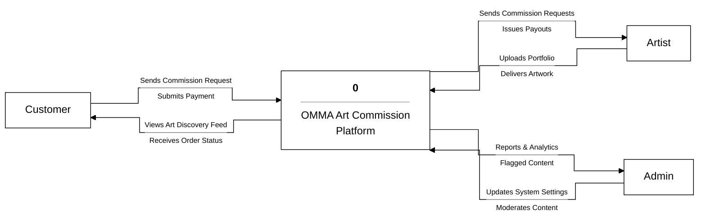
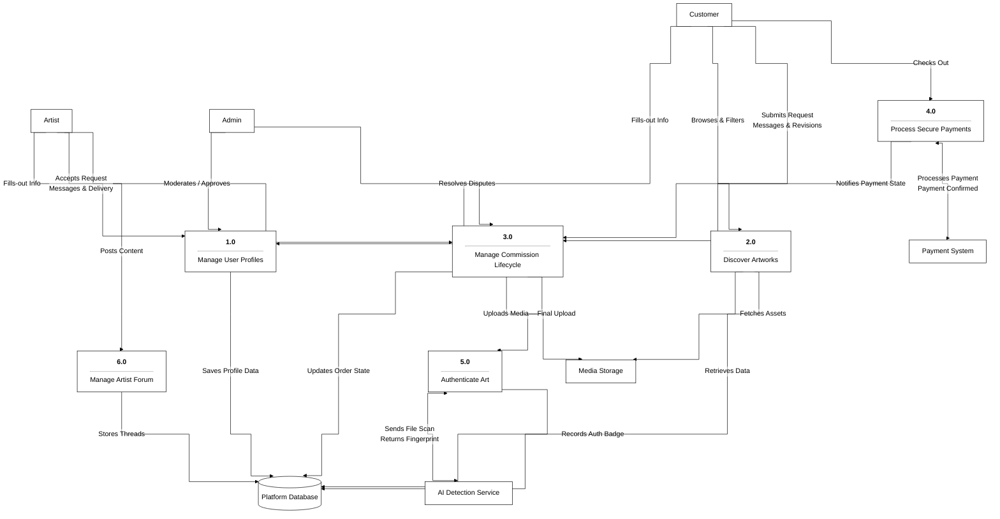
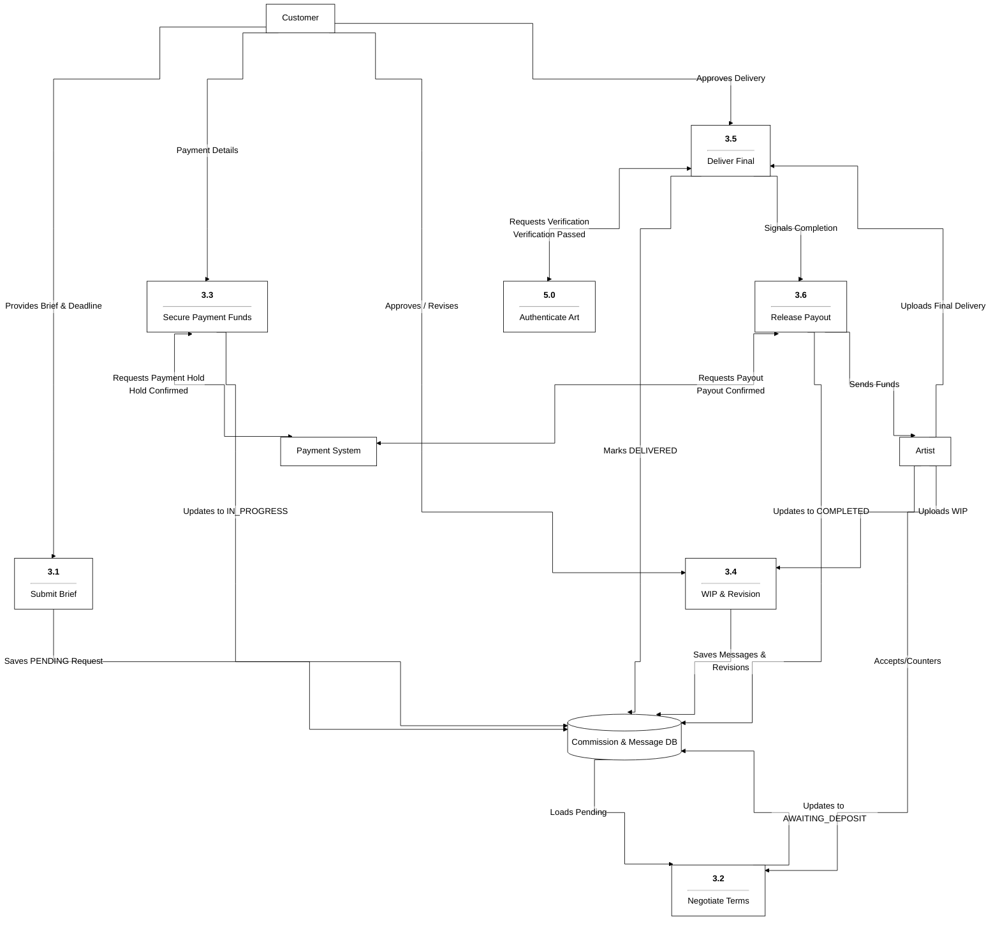

# OMMA Platform Data Flow Diagrams (DFD)

This document contains the Data Flow Diagrams (DFD) for the OMMA Platform based on the provided architecture blueprint. The visual style follows the supplied reference layouts using Mermaid.

## Level 0 Context Diagram
The Level 0 diagram provides a high-level overview of the entire OMMA system and its interactions with external entities.

---

## Level 1 Data Flow Diagram
The Level 1 diagram decomposes the system into main functional processes and generalized data stores/services. 

---

## Level 2 Data Flow Diagram (Process 3.0: Commission Lifecycle)
The Level 2 diagram provides a detailed zoom-in of the `3.0 Manage Commission Lifecycle` process, breaking down the steps from initial request to final payout.

